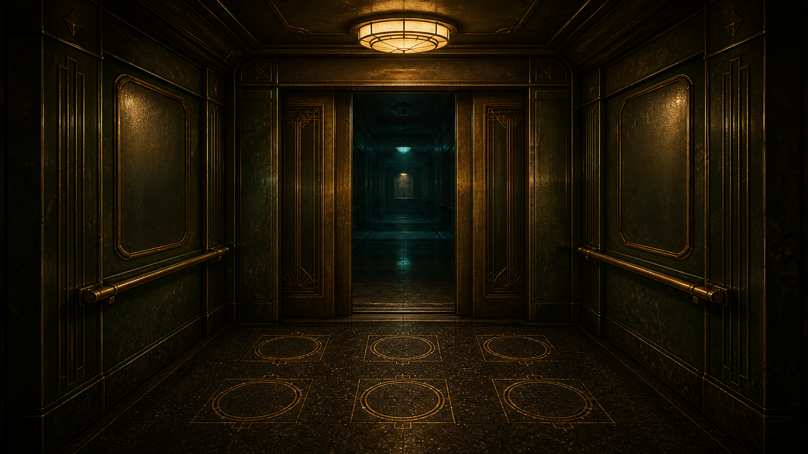

# Elevator Tales



An endless passenger-placement game set inside a midnight elevator. Arrange riders across six positions, exploit cooperation, avoid conflict, and climb as high as possible before the battery dies or cabin agitation spirals out of control.

[Play on GitHub Pages](https://lovejzzz.github.io/Elevator-Tales/) · [Stable public build](https://elevator-tales-midnight.skylab.chatgpt.site/) · [Release notes](CHANGELOG.md)

## Play

- Each floor presents three candidate riders. Choose who boards and where they stand.
- Every rider has three core values: arrival fare, power consumed per floor, and agitation.
- Adjacent riders can cooperate or conflict, and compatible effects can stack.
- You may dismiss a rider early, but you lose their arrival reward and pay compensation.
- Every tenth floor opens a supply shop where shift earnings buy power and upgrades.
- There is no final floor. Resources tighten and pressure rises as the elevator climbs.

Click a candidate and then an open position, or drag riders directly on desktop. Riders already inside may also be repositioned. Once the formation is ready, press **Close Doors & Ascend**.

The game opens in English. Use **中文** in the header—or add `?lang=zh` to the URL—to switch to the complete Chinese interface.

[Start with the guided shift](https://lovejzzz.github.io/Elevator-Tales/?tutorial=1)

## Design goal

Elevator Tales aims for a hard-fought survival rhythm: the next milestone should feel barely reachable, but good decisions should matter. Chasing coins while ignoring agitation, hoarding without investing, or relying on one dominant formation are not intended to be stable solutions. The interesting decisions come from rider combinations, position relationships, immediate risk, and preparation for the next supply floor.

Balance checks cover rule invariants, rider links, stacking, forecast accuracy, audio feedback, interaction regressions, and large batches of automated runs. Every public release records its exact value changes, verification scale, findings, and remaining watch items.

## Local development

Requires Node.js 22.13 or newer.

```bash
npm ci
npm run dev
```

Useful checks:

```bash
npm run verify
npm run simulate -- 5000
npm run build
```

## Deployment

Pushing to `main` runs the complete verification suite, creates a static export, and deploys it to GitHub Pages.

GitHub Pages uses the `/Elevator-Tales/` repository base path. The regular production build keeps the server-hosted release path intact, so the two publishing targets do not interfere with each other.

## Project map

- `components/elevator-game.tsx` — primary interface and interactions
- `lib/game-engine.ts` — floor resolution, rewards, and failure conditions
- `lib/game-data.ts` — rider and upgrade data
- `lib/game-interaction.ts` — cooperation, conflict, and stacking
- `lib/i18n.tsx` — English localization and runtime language switching
- `scripts/` — rule verification, balance simulation, and regression checks
- `CHANGELOG.md` — experiment and improvement history for every public release

## Status

The game remains in active balance and experience refinement. Issue reports are especially useful when they include the floor reached, failure cause, unclear rider text, device size, or a screenshot of a display problem.
